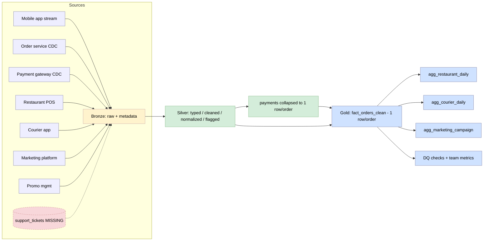

<div align="center">

# 🍔 QuickBite — End-to-End ETL Pipeline

**A PySpark Bronze → Silver → Gold pipeline over 7 raw food-delivery feeds**


</div>

> **Big Data · Final Exam · Yerevan State University (YSU)**

|  |  |
|---|---|
| 👤 **Student** | Hrant Vardanyan |
| 📘 **Course** | Big Data |
| 🏛️ **University** | Yerevan State University (YSU) |
| 👨‍🏫 **Lecturers** | Gevorg Ghalachyan, Ani Levonyan |

---

## 🎯 What this is

QuickBite is a mobile food-delivery app: customers order, restaurants cook, couriers deliver,
marketing runs promo campaigns, and payments settle (or fail, or get refunded). Seven raw CSV
feeds fall out of those systems every day. I built this pipeline to turn those files into clean,
queryable tables the rest of the company can trust — one fact at order grain plus three
daily/campaign aggregates — and to stay honest about every data problem I found on the way.

The whole solution is one PySpark notebook that runs top-to-bottom with no manual edits:
[`Hrant_Vardanyan_QuickBite_ETL_Final_Exam.ipynb`](Hrant_Vardanyan_QuickBite_ETL_Final_Exam.ipynb).

### 📊 Results at a glance

| Output table | Grain | Rows |
|---|---|:--:|
| `fact_orders_clean` | one row per `order_id` · **58 columns** | **15,000** |
| `agg_restaurant_daily` | `restaurant_id` × `order_date` | **11,847** |
| `agg_courier_daily` | `courier_id` × `order_date` | **8,616** |
| `agg_marketing_campaign` | `campaign_id` | **50** |
| `dq_check_report` | one row per check | **9 PASS · 6 WARN · 1 FAIL** |

The single `FAIL` is real, not a notebook bug: 10 promo codes point at a `campaign_id` that
doesn't exist in the campaigns table. The report is meant to catch exactly that.

---

## 🏗️ Architecture & data flow

I used a **Medallion** layout (Bronze → Silver → Gold) because it keeps the raw truth, the cleaned
truth, and the business truth in separate, auditable places.



### 🥉🥈🥇 The three layers

- **🥉 Bronze** keeps the raw load untouched — explicit schema plus `ingestion_ts`, `source_file`,
  `bronze_loaded_at`. I never rewrite a value here, so I can always trace back to the source. One
  detail that matters: I read `orders.rating` as a `Double`, not an `Int`, because the file stores
  it as `"5.0"` and a naive `IntegerType` read silently turns every rating into `NULL`. Reading it
  as a double and casting in Silver keeps all 7,174 real ratings.
- **🥈 Silver** does the cleaning: trim, lower-case, map the verified typo/casing variants, parse
  types, and dedup on the primary key (keep the most complete row, not a blind `dropDuplicates`).
  The original value stays next to the cleaned one (`status_raw` beside `normalized_status`) so
  every change is reviewable. Normalization is iterative, not a one-liner — for example I roll the
  **8 atomic cuisines up into 5 business groups** and print the before/after counts so the mapping
  is transparent and reversible.
- **🥇 Gold** is what gets queried: the order-grain fact and the three aggregates, each at a fixed
  grain with that grain asserted in code.

### 🔌 Source → processing mode

The exam gives static CSVs, but each one stands in for a live feed, and I mapped each to how it
would really land:

| Source | Real-world mode |
|---|---|
| `app_events` | **Streaming / real-time clickstream** — high-volume append-only events off a Kafka topic |
| `orders`, `payments` | **CDC micro-batch** — these rows mutate (status transitions, retries, late refunds), so I capture row changes off the DB log, not full reloads |
| `restaurants`, `couriers`, `campaigns`, `promos` | **Scheduled batch snapshots** — slow-drifting dimensions, fine as a nightly SCD load |

---

## 🔍 Data quality & observability

I treated data quality as the main event. Every anomaly below was **measured on the real data**,
tied to the team it biases, and given a disposition. I did **not** auto-"fix" anything where the
right answer is a business decision instead of a code rule.

### 🧪 The 14 anomalies I found

| # | Table | Anomaly | Rows | Disposition |
|:--:|---|---|:--:|:--|
| 1 | orders | status casing/typo variants (`DELIVERED`, `Delivered`, `delivrd`) | 79 | ✅ **fixed** (normalized) |
| 2 | orders | `accepted_ts` after `picked_up_ts` | 33 | 🚩 flagged |
| 3 | orders | `picked_up_ts` after `delivered_ts` | 65 | 🚩 flagged |
| 4 | orders | `delivered_ts` on a non-delivered order | 20 | 🚩 flagged |
| 5 | orders | `total ≠ subtotal − discount` (penny drift) | 92 | 🚩 flagged |
| 6 | payments | successful-payment total ≠ order total | 130 | 🚩 flagged |
| 7 | orders | rating present on a non-delivered order | 54 | 🚩 flagged |
| 8 | promo_codes | `campaign_id` orphaned (not in campaigns) | 10 | 🚩 flagged |
| 9 | promo_codes | `current_uses > max_uses` | 5 | 🚩 flagged |
| 10 | promo_codes | `current_uses` ≠ observed redemptions | 209 | ✋ **documented, not fixed** |
| 11 | orders | order city ≠ restaurant city | 14 | ✋ **documented, not fixed** |
| 12 | orders | promo used outside its validity window | 1,162 | ✋ **documented, not fixed** |
| 13 | support_tickets | source missing entirely | 15,000 | ✋ **documented, not fixed** |
| 14 | app_events | impression / exposure source missing | 80,000 | ✋ **documented, not fixed** |

### ✋ Why I left 5 unfixed (human judgement required)

- **#11 city mismatch** — could be a real cross-city delivery, a multi-city brand, or a data
  error. Rewriting the city would wreck the geo metrics either way, so ops should rule per case.
- **#12 promo outside window** — the validity dates are date-only, so "outside" might just be an
  allowed same-day grace. I quantify it and leave the rule to Marketing instead of guessing.
- **#10 counter vs observed** — `current_uses` is a snapshot that disagrees with the actual orders.
  I trust the observed events but flag the gap rather than overwrite a source value.
- **#13 support tickets** — the scenario mentions them, but there is no `support_tickets.csv`. I
  will not fabricate a ticket table; I compute clearly-labelled proxies instead.
- **#14 ad impressions** — `app_events` has no `campaign_id` or impression events, so true exposure
  is unobservable. Impressions stay `NULL`; I only compute the redemption side of campaign ROI.

### 🛡️ Programmatic DQ gate

A `dq_check_report` runs 16 checks across the four categories a reviewer expects, so these issues
get caught on every future load — not just this one:

| Category | What it guards |
|---|---|
| 🔗 **Referential integrity** | every FK across the 7 tables (orders→restaurants/couriers/promos, payments→orders, promos→campaigns) |
| ⏱️ **Temporal sanity** | timestamp ordering, `delivered_ts` only on delivered, campaign window not inverted |
| 🔤 **Enum validity** | status / method / vehicle / channel against their allowed sets |
| ⚖️ **Cross-table reconciliation** | payment vs order total, `current_uses ≤ max_uses`, order vs restaurant city |

Result on this data: **9 PASS · 6 WARN · 1 FAIL**. On top of those I added an edge-case assertion
suite (divide-by-zero guards, null `courier_id` handling, timestamp inversion) that fails loudly if
a guard ever regresses.

---

## 📈 Core business metrics (6 teams)

Every metric reads the usability flags on the fact, so the anomalies above don't bias it. Two per
team, kept useful instead of decorative.

- **🛒 Product** — `app_open → order` and `checkout → order` funnel conversion, and repeat-order
  rate. An "active customer" is someone with at least one *delivered* order, so retention isn't
  diluted by cancelled-only customers.
- **🍳 Restaurants** — acceptance rate, prep-time accuracy (actual vs self-reported
  `avg_prep_minutes`), and revenue. Revenue counts only orders that were **delivered and actually
  paid**, so cancelled or unpaid orders never inflate a restaurant.
- **🛵 Couriers** — on-time % (against a documented 45-minute order clock), deliveries per shift
  hour, and average **transit** time. I measure transit as `delivered_ts − picked_up_ts` on
  purpose, so a slow kitchen doesn't get blamed on the courier; the full order clock is kept as a
  separate column.
- **📣 Marketing** — promo redemption rate, cost per redeemed order, and an incremental-revenue
  proxy (campaign revenue − discount given). Impressions are `NULL` and labelled as such.
- **💳 Payments / Finance** — payment failure rate by method, refund $ as a % of delivered GMV, and
  the payment-mismatch rate (orders where the successful-payment total ≠ the order total).
- **🎧 Support** — because there's no ticket source, these are **proxies**, named as proxies:
  refund-order rate, problem-order rate (cancelled + rejected), and payment-issue rate. Real
  ticket-rate and complaint-category share need a `support_tickets` feed, and I say so.

---

## ⚡ Spark optimization

The heavy job is building `fact_orders_clean`. I run `.explain()` on it, look for shuffles and
skew, then apply optimizations and measure them with an **eager `.count()`** action (Spark is lazy,
so timing the transformations alone measures nothing).

- **Broadcast the 4 small dimensions.** Without it, Spark shuffles the 15k-row orders stream into a
  `SortMergeJoin` for every dimension. Broadcasting turns each into a `BroadcastHashJoin` and the
  shuffle `Exchange` on the orders side disappears — the plan goes from **6 SortMergeJoins / 13
  shuffles** to **0 SortMergeJoins / 6 BroadcastHashJoins / 9 shuffles**.
- **Cache the reused fact**, plus AQE shuffle coalescing, and built-in functions only (no UDFs).
- **Skew, measured honestly.** The most concentrated key is **`city`, where `YVN` holds 55.69%** of
  non-null rows (computed with NULLs excluded, so a mostly-empty key like `promo_code` doesn't
  falsely report `NULL` as its hot value). At this size `YVN` rides inside a broadcast join and
  never reaches a shuffle, so salting isn't justified yet — I document when it would be.

---

## 🚀 Scalability & production roadmap (toward 100×)

This runs locally on ~110k rows, but I built it so the jump to ~11M+ orders/day is a configuration
change, not a rewrite.

- **Skew.** Today the dimensions broadcast and the `YVN` skew costs nothing. At 100× the dimensions
  stop fitting under the broadcast threshold and fall back to `SortMergeJoin`, where `YVN` becomes
  one hot reduce partition. Mitigations, in order: turn on **AQE skew join**
  (`spark.sql.adaptive.skewJoin.enabled=true`, default-on with AQE in Spark 3.x) so Spark
  auto-splits the oversized partition, and if that isn't enough, **salt** the hot key (append a
  random bucket to `city`, aggregate back) to spread it across tasks.
- **Storage.** CSV → **partitioned Parquet/Delta**, with `agg_*_daily` written
  `partitionBy("order_date")` after a `repartition("order_date")`, so readers prune to the days they
  need instead of scanning everything.
- **Ingestion.** `app_events` as real structured streaming off Kafka; `orders`/`payments` via CDC;
  the dimensions as SCD-2 — with **incremental** runs over new/changed partitions, not full reloads.
- **Quality as a gate.** The `dq_check_report` becomes a blocking step with alerting, so a `FAIL`
  stops Silver from being promoted to Gold, plus freshness / row-count-drift / null-rate monitoring.

---

## 🛠️ Setup & local execution

> **Prerequisite:** Java 17 on the `PATH` (PySpark needs a JVM — I used Temurin 17).

```bash
# 1. Clone
git clone https://github.com/Vardanyan188/big-data-quickbite-pipeline.git
cd big-data-quickbite-pipeline

# 2. Isolated environment
conda create -n pyspark python=3.12 -y
conda activate pyspark

# 3. Dependencies
pip install pyspark==3.5.1 pandas matplotlib jupyter ipykernel pyarrow

# 4. Register the kernel
python -m ipykernel install --user --name pyspark --display-name "Python (pyspark)"
```

**▶️ Run it interactively** — open the notebook, pick the *Python (pyspark)* kernel, Run All:

```bash
jupyter notebook Hrant_Vardanyan_QuickBite_ETL_Final_Exam.ipynb
```

**🤖 Or run it headless** (executes top-to-bottom and writes the outputs):

```bash
jupyter nbconvert --to notebook --execute --inplace \
  --ExecutePreprocessor.kernel_name=pyspark \
  --ExecutePreprocessor.timeout=600 \
  Hrant_Vardanyan_QuickBite_ETL_Final_Exam.ipynb
```

The notebook self-installs PySpark if it's missing and resolves the data folder automatically, so a
fresh machine still runs it cleanly.

### 📁 Repository layout

```
big-data-quickbite-pipeline/
├── Hrant_Vardanyan_QuickBite_ETL_Final_Exam.ipynb   # the full solution — run this
├── data_quickbite/                                  # 7 real input CSVs
│   ├── app_events.csv      orders.csv      payments.csv
│   ├── restaurants.csv     couriers.csv    marketing_campaigns.csv
│   └── promo_codes.csv
├── outputs/                                          # generated gold tables, reports, dashboard.png
└── README.md
```

---

<div align="center">

*Built for the YSU Big Data final exam — on the real provided data only.*
**No synthetic records · no invented support tickets · no faked impressions.**

</div>
